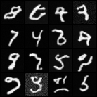
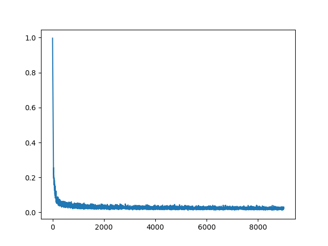

# Diffusion playground
A place to play with Diffusion models

## About the code
### Two ddpm versions:
The differences vs ddpm-v1 and ddpm-v2 are minor. 
- v-2 precompute some scalars like alpha-bars and square-roots of other scalars beforehand and therefore the code is shorter. 
- v1 on the other hand compute some of these scalars on the fly and is a bit longer but more straight forward and pedagogic

### Denoiser architecture

I added two architecture:
- Dummy is just stacked MLPs that map an image to image of the same dimension
- GenericUnet receives a list of spacial dimensions and creates a Unet with that many intermediate layers, each in the according spatial dimension. For example GenericUnet(scales=(32, 16, 8)) will have 6 intermediate feature maps **64x64->16x16->8x8->16x16->64x64**.

## Usage
Have a look at all the possible parameters at main.py

### Train on mnist
```
python3 main.py --ddpm_imp v2
```
Outputs after 9000 train steps:

<p float="center">
  
   
</p>

### Train on other dataset
dataset folder should have sub-folders with images
```
python3 main.py --data_path <path to dataset> --c 3
```


# Credits
- https://github.com/BrianPulfer/PapersReimplementations/blob/main/ddpm/models.py
- https://github.com/VSehwag/minimal-diffusion.git
- https://github.com/cloneofsimo/minDiffusion